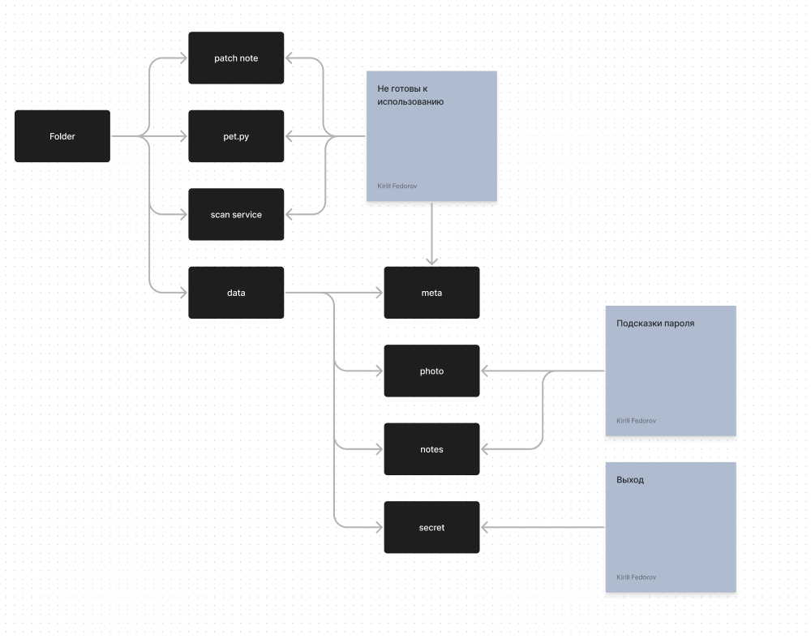

# FolderQuest

Телеграм бот для интерактивной текстовой игры "Folder".

## Описание

Игра представляет собой текстовый квест, 
в котором игроку предстоит пройти через файловую систему, 
состоящее из папок и файлов, в каждом из которых игроку предстоит решить задачу, 
чтобы пройти в конечную папку.

## Инструкции по использованию
- Начало приключения:
  - Найди бота в Telegram: @FolderQuestBot.
  - Запусти бота командой /start.
  - Начинай путешествие по файлам.
- Принимай Решения:
  - Вводи свои ответы или команды, чтобы двигаться дальше в истории.
- Остерегайся Опасностей:
  - Встречай ошибки и решай сложные головоломки. 
  - Твои навыки и решения могут спасти тебя или поставить в опасность.
  

  
Подсказки

  
  

  
Карта квеста

  
  
  
  

  

  
Подсказка

  
  Чтобы найти пароль надо два раза перевести имя пользователя
  
  

  

## Ссылки на изображения
В проекте использовались изображения, сгенерированные нейросетью Stable Diffusion.

Все изображения можно найти по ссылке на [Яндекс.Диск]().

## Контакты
Для связи с разработчиками можно использовать следующие контакты:

- [Telegram](https://t.me/stifild)
